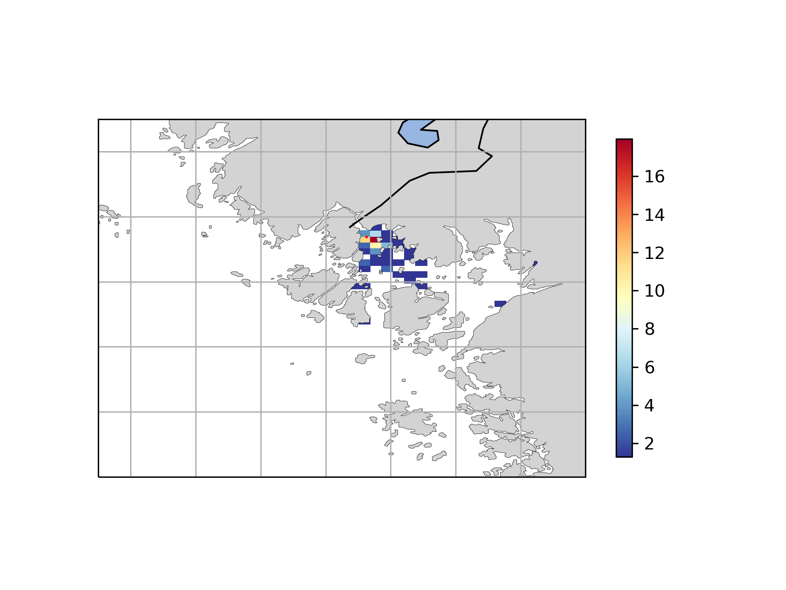

![Build status][image-1]
![CodeBeat][image-2]
![CodeCov][image-3]

# Simulating particles and sedimentation in Glomma river

**Langragian particle tracking framework**
Repository for developing sediment module for OpenDrift for modelling flow of particles in Glomma. 

Code for animating particles and plotting trajectories have been added. Any plot or animation should be initialized using the `config_plot.py`
file and the main script file `create_maps_and_animations.py`. 

**Run particle drift**
Run particle tracking of clay and sand particles of different diameters and densities after initializing `config_sedimentdrift.py`. The current setup 
initializes the diameters and densities of particles using aGaussian distribution function with mean and standard deviations as observed 
for Glomma in June 2020 using a *LISST* instrument.
```python
self.diameters = self.generate_gaussian_distribution(0.05e-3, 0.01e-3/3., self.number_of_particles)
self.densities = self.generate_gaussian_distribution(1200, 1000/3., self.number_of_particles)
```

**Calculate sedimentation**
After running the model we now have to analyse the output. This is done using various plotting and animation scripts (see below) but the key 
script is called `probability_distibution_v2.py`. The script organizes the simulation results by grouping into 
individual trajectories.
```Python
df = xr.open_mfdataset(file_list, concat_dim='trajectory', combine='nested')
ds = df.groupby(df.trajectory).apply(self.extract_data, args=(filter_options,))
```
Once grouped we can filter the data per trajectory to only analyse what we are interested in. This is done by submitting an
options dictionary to the groupby.apply function.

```Python
 filter_options = {"density_min": 0,
                   "density_max": 2000.,
                   "selected_month": 2,
                   "selected_day": 7,
                   "status": 1}
```

This particular filter will keep only particles with densities between `0` to `2000`, for month `2` (February), day `7`, and only 
keep particles that have settled on the bottom  (`status=1`). The data are then organized into bins that cover the region of interest 
with the given resolution of interest. For example, you can define the resolution of the bins to be `1km`, `1m` or whatever you want and 
this is done in the file `config_plot.py`. The histogram is then calculated for the bins and displayed as a pcolormesh plot.



**Plotting**
- `create_maps_and_animations.py` - main plot script
- `config_plot.py` - configure and setup common plot properties  
- `animate_catter.py` - class for animating particles
- `particle_tracks.py` - class for plotting the particle trajectories
- `plot_particles_at_depth.py`- plots time versus depth for three different densities / density ranges of clay

**unittests**
A number of simple unittests are used to ensure that the methods of the toolbox behaves as they should once changes have been pushed 
to Github. The tests are all unittests but we use `nose2`to run the tests and to collect coverage information.
 
 ```sh
nose2 --with-coverage
```


*16.07.2020* - updated unit tests to include tests for generating diameter, densities, and calculating terminal velocity for various buoyancies.

[image-1]:	https://badge.buildkite.com/9fe63ac4afc901fb503d10d67c26175d7071137729c00d1b17.svg
[image-2]:	https://codebeat.co/badges/8913543f-2a74-4c67-868f-d42f917338c6
[image-3]:	https://codecov.io/gh/trondkr/Glomma_particles/branch/master/graph/badge.svg